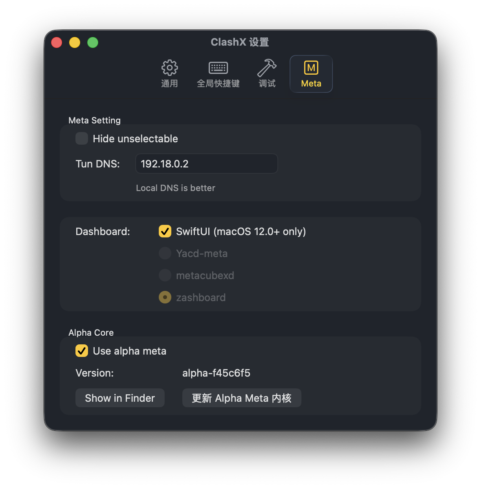

# Clash Config Script

一个基于 Cloudflare Workers 的订阅转换 api 服务，用于将机场订阅转换为优化的 Clash 配置文件，并提供 token 订阅管理。

[](https://deploy.workers.cloudflare.com/?url=https%3A%2F%2Fgithub.com%2Fjctaoo%2FClashConfig)

## ✨ 特性

- 🚀 **无服务器部署**: 基于 Cloudflare Workers，全球加速访问
- 📦 **跨平台使用**: 支持 **Clash.Meta** 和 **Clash Premium** (Stash App) 内核
- 🎯 **智能规则**: 内置优化的分流规则，支持 GEOIP、GEOSITE 数据，多 DNS 与分流规则可配置
- 🔒 **安全的网络体验**: 避免 DNS 泄露
- 🌍 **地区筛选**: 支持按地区过滤节点
- 🔐 **Token 管理**: 支持 Token 订阅管理，可配置节点过滤，feel free to share token with your friends
- ⚙️ **CLI 工具**: 提供命令行工具，方便管理订阅和生成 token
- 📒 **生成脚本**: 支持生成全局扩展脚本，适配 Clash Verge 等客户端
- 🎮 **裸核心支持**: 支持直接使用 Clash 核心运行，无需客户端 UI

## ⚡ 快速开始

打开 [https://clash.jctaoo.site](https://clash.jctaoo.site) 来使用, 或者将原始订阅链接转换为 base64 编码后，直接使用下面的链接作为订阅 URL

```txt
https://clash.jctaoo.site/sub?sub=<base64-encoded-url>
```

> 更进一步，可以使用基于 token 管理的配置获取 API，支持筛选节点等功能，参考下方 API 指南

## 🖥️ API 指南

### 📱 User-Agent 说明

ClashConfig 会**根据请求的 User-Agent 自动识别客户端类型**，并返回对应内核的优化配置：

#### 支持的客户端内核

1. **Clash.Meta (Mihomo)**:
   - 客户端：Clash Verge、ClashX.Meta 等
   - 返回：完整的 Mihomo 内核配置，包含所有高级特性

2. **Clash Premium (Stash)**
   - 客户端：Stash
   - 返回：兼容 Stash 的配置，自动展开 `GEOSITE` 规则为具体域名列表 (nameserver-policy 中)
   - **特殊处理**：由于 Stash 限制，`strict` DNS 策略会自动降级为 `direct` 策略

#### 裸核心使用方法

如果你直接使用 Clash 核心（如 `mihomo`）而不是带 UI 的客户端，需要**手动指定 User-Agent**, 将 `mihomo -v` 命令的第一行返回值作为 User-Agent 使用即可，例如:

```bash
> ./mihomo.exe -v
Mihomo Meta v1.19.14 windows amd64 with go1.24.7 Wed Sep 24 09:12:02UTC 2025
Use tags: with_gvisor
```

将 `Mihomo Meta v1.19.14 windows amd64 with go1.24.7 Wed Sep 24 09:12:02UTC 2025` 作为 User-Agent 进行请求即可。

> 💡 **提示**：大多数 Clash 客户端会自动发送正确的 User-Agent，无需手动设置

### 1. `/sub` - 基础订阅转换

**功能**: 将机场订阅地址转换为优化后的 Clash 配置

**参数**:

- `sub` (必需): Base64 编码的订阅 URL
- `convert` (可选): 是否进行配置优化，默认 `true`，设置为 `false` 则原样返回上游订阅并转换为客户端需要的格式
- `regions` (可选): 基于地区节点过滤，使用逗号分隔，如：`HK,US,JP`
- `rate` (可选): 基于计费倍率过滤，只保留计费倍率小于等于该值的节点，默认为空
- `filter` (可选): 节点名称过滤正则，移除掉不符合该正则的节点，该参数会传入 js 的 `RegExp`，默认为空
- `nameserver` (可选): 设置 dns nameserver 组, 支持 `direct` 和 `strict`，默认 `strict`
- `rules` (可选): 未命中规则流量 dns 解析策略，支持 `always-resolve` 和 `remote`，默认 `remote`
- `quic` (可选): 禁用 quic，默认 `true`
- `level` (可选): 日志等级，支持 `debug`, `info`, `warning`, `error`, `silent`，默认 `warning`

> 参见 [参数说明](#params) 了解更多

**使用示例**:

```txt
https://clash.jctaoo.site/sub?sub=<base64-encoded-url>
https://clash.jctaoo.site/sub?sub=<base64-encoded-url>&convert=false
```

### 2. `/:token` - Token 订阅

**功能**: 使用 Token 获取订阅，相当于短链接的效果，不会在 url 上暴露订阅地址和参数，可以配置过滤节点后分享给他人使用

> 处于安全考虑，该接口的 Token 仅能通过 cli 工具进行生成，并且支持自部署的方式，参见 [CLI 工具使用指南](#cli) 和 [部署](#deploy)

**参数**:

- `token` (必需): 通过 CLI 工具生成的用户 Token（格式: `sk-xxxxx`）

**使用示例**:

``` txt
https://clash.jctaoo.site/sk-your-token
```

**使用流程**:
1. 使用 `pnpm run cli add` 添加订阅并获取 token
2. 将 token 添加到 Clash 订阅地址: `https://clash.jctaoo.site/sk-your-token`
3. 使用 CLI 工具管理和更新订阅配置

## 💡 客户端说明

- 可以为订阅设置自动更新，1440分钟更新一次
- clash-verge-rev: 打开 虚拟网卡模式，关闭系统代理，虚拟网卡配置中，开启 严格路由
- clashx.meta: 根据如下图片配置，然后使用 tun 模式，关闭系统代理 
  > https://github.com/MetaCubeX/ClashX.Meta/issues/103#issuecomment-2510050389
- 其他客户端: 使用 tun 模式

<a id="deploy"></a>

## ☁️ 部署

使用 Cloudflare Workers 快速部署，点击下方按钮即可

[](https://deploy.workers.cloudflare.com/?url=https%3A%2F%2Fgithub.com%2Fjctaoo%2FClashConfig)

<a id="cli"></a>

## 🔧 CLI 工具使用指南

这是一个用于管理 Cloudflare KV 中订阅的命令行工具。

### CLI 命令

#### 1. 添加订阅（交互式）

```bash
pnpm run cli add
```

该命令会通过交互式提示引导你输入所有必要信息，并自动生成 token。参数说明参见 [参数说明](#params)。

#### 2. 获取订阅信息

```bash
pnpm run cli get sk-your-token
```

该命令会显示指定 token 的订阅详细信息。Token 会保存在订阅信息中，可以随时通过此命令重新获取。

#### 3. 获取订阅链接

```bash
# 使用默认 base-url (https://clash.jctaoo.site)
pnpm run cli link sk-your-token

# 获取链接并自动在 Clash 中打开
pnpm run cli link sk-your-token --go
# 或使用简写
pnpm run cli link sk-your-token -g

# 自定义 base-url
pnpm run cli link sk-your-token --base-url https://your-worker.workers.dev

# 自定义 base-url 并打开
pnpm run cli link sk-your-token -b https://your-worker.workers.dev -g
```

该命令会生成完整的订阅链接。使用 `--go`/`-g` 参数可以自动生成 Clash URL scheme 并打开 Clash 客户端导入配置。

**参数说明：**
- `--base-url` / `-b`: Worker 部署的 base URL（默认：`https://clash.jctaoo.site`）
- `--go` / `-g`: 生成 Clash URL scheme 并自动打开（支持 Windows/macOS/Linux）

#### 4. 更新订阅（使用编辑器）

```bash
pnpm run cli update sk-your-token
```

该命令会打开你的默认编辑器，显示当前订阅信息的 JSON 格式，你可以直接在编辑器中修改。保存后会自动更新订阅。参见 [参数说明](#params)。

#### 5. 删除订阅

```bash
pnpm run cli delete sk-your-token
```

#### 6. 列出所有订阅

```bash
pnpm run cli list
```

该命令会列出所有已保存的订阅信息，包括 token、标签、URL 等关键信息。

### KV Key 格式

- **用户 Token 格式**: `sk-{32位随机十六进制字符串}`
- **KV Key 格式**: `kv:{SHA256(用户Token)}`
- **存储值**: JSON 格式的 `ClashSubInformation` 对象

### 示例：完整工作流

```bash
# 1. 添加订阅
pnpm run cli add

# 2. 查看订阅信息
pnpm run cli get sk-your-token

# 3. 获取订阅链接并在 Clash 中打开
pnpm run cli link sk-your-token --go

# 4. 更新订阅
pnpm run cli update sk-your-token

# 5. 列出所有订阅
pnpm run cli list

# 6. 删除订阅
pnpm run cli delete sk-your-token
```

### CLI 注意事项

1. **Token 持久化**: 生成的 User Token 会自动保存在订阅信息中，可以随时通过 `get` 命令重新获取，无需担心丢失
2. **KV 命名空间**: 默认使用 wrangler.jsonc 中配置的 KV binding (默认为 "KV")
3. **Wrangler 依赖**: 需要安装并配置 Wrangler CLI
4. **身份验证**: 确保已通过 `wrangler login` 登录到 Cloudflare 账户


<a id="params"></a>

## 📃 参数说明

| 参数 | 字段 | 说明 | 默认值 | 是否必填 |
| --- | --- | --- | --- | --- |
| 订阅链接 | `sub` | base64 编码的订阅 URL | 无 | ✅ |
| 是否进行配置优化 | `convert` | false 原样返回上游订阅并转换为客户端需要的格式 | true | ❌ |
| 基于地区节点过滤 | `regions` | 用逗号分隔，如：HK,US,JP | 无 | ❌ |
| 基于计费倍率过滤 | `rate` | 只保留计费倍率小于等于该值的节点 | 无 | ❌ |
| 节点名称过滤正则 | `filter` | 移除掉不符合该正则的节点，该参数会传入 js 的 `RegExp` | 无 | ❌ |
| dns 设置 | `nameserver` | 设置 dns nameserver 组, 支持 `direct` 和 `strict` | `strict` | ❌ |
| dns 解析策略 | `rules` | 未命中规则流量 dns 解析策略，支持 `always-resolve` 和 `remote` | `remote` | ❌ |
| 禁用 quic | `quic` | 禁用 quic | true | ❌ |
| 日志等级 | `level` | 日志等级，支持 `debug`, `info`, `warning`, `error`, `silent` | `warning` | ❌ |

两种 DNS 策略的排列组合会形成不同的效果，根据实际需求来做选择

> 🔒 表示不会 DNS 泄露， ⚠️ 表示有相关风险，但不代表一定泄露，如果需求只是对于绝大多数如 google 在内的黑名单网站不泄露，则可以忽视相关泄露风险

| rules / nameserver | `direct` | `strict` |
| ----------- | ------ | ------ |
| `always-resolve` | ⚠️ `国外未知域名通过 direct dns，泄露` | 🔒 `缺点在于国外小众网站会进行多余 DNS 解析，国内小众网站可能无法命中最优结果，但 ecs 有所缓解` |
| `remote` | 🔒 `缺点在于国内小众网站会走代理` | 🔒 `缺点在于国内小众网站会走代理` |

> 目前 Stash 不支持 `strict` 策略，如果指定 `strict` 策略，会自动切换为 `direct` 策略。另外使用 `direct` 策略的同时最好打开 `quic` 选项来禁用 quic 协议


## 💻 Development

### 前置要求

1. 安装 Node.js 和 `pnpm`（请先安装 Node.js，然后参见 [pnpm](https://pnpm.io) 获取 pnpm 安装说明）

### 开发步骤

1. **安装依赖**
   ```bash
   pnpm install
   ```

2. **登录 Cloudflare**（重要！）
   ```bash
   pnpm exec wrangler login
   ```
   这将打开浏览器进行 Cloudflare 账户授权。登录后才能访问 KV 存储和部署服务。

3. **生成 Geo 相关脚本**
   ```bash
   pnpm run pb-gen && pnpm run pb-gen-dts
   ```

4. **生成 Cloudflare Workers 类型定义**
   ```bash
   pnpm run cf-typegen
   ```
   这将根据 `wrangler.jsonc` 配置生成 TypeScript 类型定义文件，包括 KV、环境变量等的类型。

5. **启动开发服务器**
   ```bash
   pnpm run dev
   ```
   开发服务器将在本地启动，可以进行调试和测试。


## 🎯 TODO

- [ ] 1. 迁移到 GEOSITE, 避免使用 classic behavior 规则，stash 支持 `strict` 策略 
- [ ] 2. 检查 https://github.com/DustinWin/ShellCrash/blob/dev/public/fake_ip_filter.list 以补全 fake-ip-filter
- [ ] 3. subrequest 被 cloudflare 缓存

